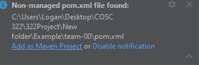

# 322GameOfAmazons
Game of Amazons project for COSC 322

# How to run with IntelliJ

- **Step 1: Open folder as IntelliJ project**

- **Step 2: Open as Eclipse Project**

- **Step 3: Add the non-managed Pom File as a Maven Project**

- **Step 4: Verify the project builds with Maven, run using commands "clean compile install"**

- **Step 5: Add "user pass" to program arguments in your run config (Under Run -> Edit Configurations)**

## Formating
- [Linting with IntelliJ](https://github.com/cosc-322-main-team/322GameOfAmazons/blob/main/team-01/documentation/linter-setup-instrutions.md)
